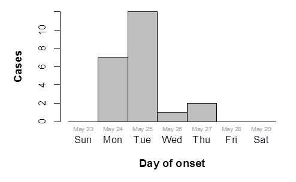

Overview
========

Having good data is essential when developing mathematical models; however, it is often hard to come by. Modelers must often rely on data, collected by others, that were obtained via epidemiological studies (e.g. outbreak investigations). Outbreak investigations are often conducted to provide researchers with information on both the natural history of the disease (e.g. prognosis, duration of symptoms, etc.) and on risk factors associated with developing the disease.

This group will be resident "epidemiologists on call" and must be willing to: respond to any outbreaks that occur while the clinic is in session, obtain relevant data, and conduct appropriate analyses to describe the details of the outbreak and identify possible risk factors. **No prior knowledge of epidemiology or outbreak investigations is necessary.**

Things to consider
==================

-   This project uses data from a real-time, stochastic simulation of an outbreak in workshop participants. For this reason, the data are very much like real data in some ways (there is substantial noise and transmission occurs through a real contact network) but very unlike real data in other ways (we have near-perfect information about the underlying dynamic process, such as who infected whom when, how many potentially infectious contacts each case had, each case's effective reproduction number, when each case "recovered," etc).

-   **This group is recommended for:**
    -   Participants with little or no prior experience with data collection or analysis
    -   Track A participants
    -   Track B participants interested in gaining a better understanding of what models can and can't help you achieve with regard to understanding data

-   **This group will have the opportunity to engage in any of the following:**
    -   Develop questionnaires, collect, de-identify, and analyze data
    -   Develop a simulation of MMF spread and parametrize the model using outbreak data
    -   Use statistical techniques to infer the transmission tree of the MMF outbreak (ie, who infected whom) from the epidemic curve and compare the inferred trees to the underlying transmission tree
    -   Analyze the social network of MMED participants and assess whether the MMF outbreak was larger than expected by chance
    -   Develop and address their own questions with regard to MMF spread

Background
==========

In recent years, outbreaks of a novel disease now known as Muizenberg Fever (MF) have occurred in Muizenberg, South Africa. The disease is also known as Muizenberg "Mathematical" Fever (MMF) since it has only been observed while the annual MMED clinic is in session at the African Institute for Mathematical Sciences (AIMS). While symptoms of the disease are almost exclusively benign, local public health professionals suggest maintaining continued vigilance so that the etiology and natural history of this disease can be better understood.

{:width="50%"}

Resources
=========

Background information on outbreak investigations is provided in [this paper by A. Reingold](http://www.ncbi.nlm.nih.gov/pmc/articles/PMC2627658/pdf/9452395.pdf "Reingold 1998")
