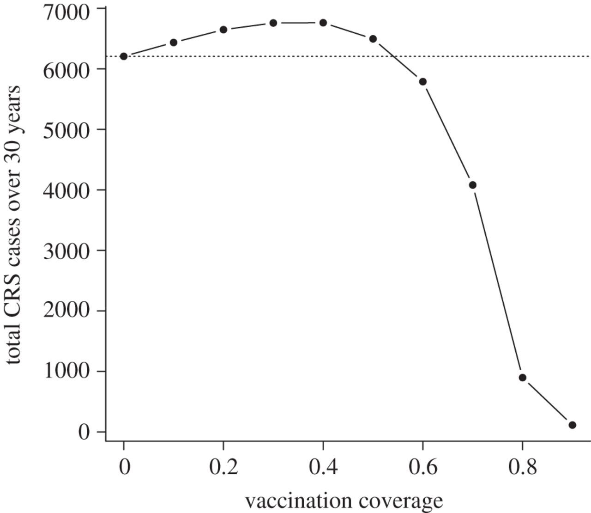

## Overview

South Africa is considering introduction of routine vaccination against rubella virus; however, there are concerns that vaccination will increase the average age of infection, which could in turn increase the incidence of congenital rubella syndrome (CRS), as described in Metcalf _et al_. 2012: 

{:refdef: style="text-align: center;"}
{:width="25%"}
{: refdef}

This group will explore the relationship between age and the force of infection, as a first step toward understanding the baseline risk of CRS in South Africa. The analysis will use cross-sectional serological data from the Western Cape, South Africa.

## Things to consider

- _This group is recommended for:_
    - Participants interested in understanding how models can be used to inform policy decisions
    - Participants interested in practicing formulation of likelihoods
    - Participants interested in developing code for fitting models

- _This group will have the opportunity to engage in any of the following:_
    - Maximum likelihood fitting of catalytic models
    - Comparison of models using formal criteria
    - Use of reproducible research practices

## Data

- Data on IgG serostatus and age will be provided to project group members. Because the data are not publicly available, group members will be asked to sign a non-disclosure agreement stating that they agree not to use the data for any purpose other than the MMED 2019 group project without explicit written permission.

## Resources

### References

- Grenfell, BT, and Anderson RM. (1985) [The Estimation of Age-Related Rates of Infection from Case Notifications and Serological Data](https://europepmc.org/articles/pmc2129533/pdf/jhyg00008-0199.pdf). _J Hyg (Lond)_. 95(2): 419–436.
- Lessler, J, and Metcalf CJE. (2013) [Balancing evidence and uncertainty when considering rubella vaccine introduction](https://journals.plos.org/plosone/article/comments?id=10.1371/journal.pone.0067639). _PloS One_.8(7): e67639.
- Vynnycky E, Adams EJ, Cutts FT, Reef SE, Navar AM, Simons E, _et al_. (2016) [Using Seroprevalence and Immunisation Coverage Data to Estimate the Global Burden of Congenital Rubella Syndrome, 1996-2010: A Systematic Review](https://journals.plos.org/plosone/article?id=10.1371/journal.pone.0149160). _PloS One_. 11(3): e0149160.
- Metcalf CJE, Cohen C, Lessler J, McAnerney JM, Ntshoe GM, Puren A, _et al_. (2012) [Implications of spatially heterogeneous vaccination coverage for the risk of congenital rubella syndrome in South Africa](https://royalsocietypublishing.org/doi/full/10.1098/rsif.2012.0756). _J R Soc Interface_. 10(78): 20120756–20120756.
- Cutts  F T, Vynnycky E. (1999) [Modelling incidence of CRS in developing countries](https://academic.oup.com/ije/article/28/6/1176/771538). _Int J Epid_. 28: 1179–1184.

### Tutorials

- [R Tutorials: Lab 5](../tutorials) - Introduction to Likelihood Lab
- [R Tutorials: Lab 6](../tutorials) MLE fitting of an SIR model to prevalence data
    - including: Parameter transformation - [Slides](../tutorials/parameterTransformations.pdf)
