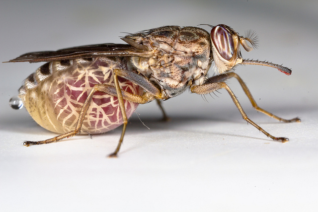

## Overview

  

      
<b>At what life stages can tsetse flies acquire infection with the trypanosome <em>T. congolense</em>?</b>

      
 Tsetse flies are the vectors of trypanosmiases, diseases of livestock and humans. The flies require regular blood meals to survive and reproduce.

      
 Three major species groups of trypanosome are recognised: <em>T. vivax</em>, <em>T. congolense</em> and <em>T. brucei</em>. All three species have cyclical forms in both the vertebrate and fly hosts – but the species vary in their pattern of development within tsetse.

      
 All tsetse are born uninfected – the adult must bite an infected vertebrate in order to acquire the infection. 

      
 Laboratory studies and field data suggest that tsetse can acquire a <em>T. vivax</em> infection throughout their lives, whiel tsetse only appear to be able to acquire a <em>T. brucei</em> infection when they take their first blood-meal. It is not currenlty known whether tsetse can acquire <em>T. congolense</em> infections after their first bloodmeal.

      
 In this project we will model the acquisition of trypanosome infections by the tsetse fly <em>Glossina pallidipes</em> Austen to investigate the timing of infection for <em>T. congolense</em>.

  

  

      
      <a href="https://www.flickr.com/photos/oregonstateuniversity/10040375154/in/photolist-giexJs-dteEn5-dtet98-fstqeX-dRo1dd-8UbzgF-oCDocs-zi39s-dwBgLz-7djL6s-dr7JVJ-7dgMwp-fvhuwf-d4RUJS-8on7Yc-8E1emp-3YSJr2-dr7GtW-6Vmgup-dr7whv-Bfrn5S-5KT5we-7WkSe2-BEgfNL-fnh1U4-dRo19h-dwGLHb-dr7zva-dwGMnE-dr7KLf-dr7yXa-dRhrMi-dwBgnF-dr7zTz-dwBgDH-dRo1aW-dr7K29-dr7GKC-dRhrH6-dr7y92-7WkNfg-dr7HCQ-DEij9-pPEoeU-8Mz1g-7WkRfD-dr7z5V-dRhrJV-dr7Kwq-dr7xrK">Photo courtesy of Oregon State University</a>
  

## Things to consider

- The faculty member leading this project is based in South Africa, where it is 4 hours earlier than in Dhaka and 9 hours later than in Seattle.

- _This group is recommended for participants who are interested in:_
    - Tsetse flies and trypanosomiasis
    - Modelling of vector-borne pathogens
    - Engaging, interpreting, and analysing existing data

- _This group will have the opportunity to engage in any of the following:_
    - Writing code in R  

## Background

Students need to familiarise themselves with the basic biology of tsetse (Hargrove, 2004). Essential features may be summarised as follows:

- Tsetse feed only on vertebrate blood.
- They take large meals, generally greater than their own body weight, at intervals of approximately three days.
- When feeding, tsetse can acquire trypanosome infections from those of a host that is itself infected trypanosomes.
- If a trypanosome infection becomes established in a fly, it can pass on the infection to those of their vertebrate hosts that are susceptible to infection.
- Wild African non-human hosts act as reservoirs of infection: they generally do not suffer ill effects of the trypanosome infections.
- Tsetse produce only one offspring at a time: a single larva is deposited at approximately 9-day intervals.  
- This very low birth rate means that populations can only survive if adults have mortality rates that are much lower than is common for most insects.
- Ovarian dissection can be used to assess how many times a fly has ovulated, and provide thereby an estimate of the fly’s age.
- There is a problem in that we can only provide the exact number (c) of ovulations completed for c < 4. Thereafter we can only estimate c modulo 4: that is to say, we cannot tell the difference between flies that have ovulated, 4, 8, 12 etc times. Similar statements apply to flies that have ovulated 5, 9, 13 etc times, 6, 10, 14 etc times and 7, 11, 15 etc times.
- This estimate can be improved using information on the degree to which the flies’ wings have been damaged as a function of age.

## Data

We have access to data relating the probability that female _G. pallidipes_ are infected with various species of trypanosome to their ovarian age, or the degree of fray of their wings. The following data sources and other resources will be made available to group members:

- Infection rates as a function of ovarian age (for _T. vivax_, _T. congolense_, and _T. brucei_)
- Infection rates as a function of wing fray category (for _T. vivax_, _T. congolense_, and _T. brucei_)

## Resources

### Detailed project overview

- Dowload PDF

### References

(available to project group, and upon request to other ICI3D participants)

- Hargrove, J.W. (2004) Tsetse population dynamics. in The Trypanosomiases (Eds. I. Maudlin, P.H. Holmes & P.H. Miles) pp 113-137. CABI publishing, Oxford, UK.
- Kubi, C., Van den Abbeele, J., De Deken, R., Marcotty, T., Dorny, P., & Van den Bossche, P. (2006). The effect of starvation on the susceptibility of teneral and non‐teneral tsetse flies to trypanosome infection. Medical and Veterinary Entomology, 20, 388-392.
- Welburn S.C. & Maudlin I. (1992) The nature of the teneral state in Glossina and its role in the acquisition of trypanosome infection in tsetse, Annals of Tropical Medicine & Parasitology, 86:5, 529-536. DOI: 10.1080/00034983.1992.11812703
- Woolhouse, M.E.J., Hargrove, J.W. & McNamara, J.J. (1993) Epidemiology of trypanosome infections of the tsetse fly Glossina pallidipes in the Zambezi Valley. Parasitology, 106, 479-485.

### Tutorials

- Tutorial 4: [Visualizing Infectious Disease Data in R](./visualizeData) (recommended)

